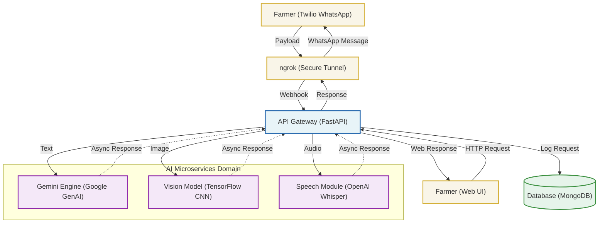

<div align="center">
  <h1>🌾 KrishiMitra (कृषि मित्र)</h1>
  <p><strong>AI-Powered Agricultural Advisory Chatbot for Indian Farmers</strong></p>
</div>

---

## 📌 Project Overview
**KrishiMitra** is a production-ready, highly resilient AI chatbot designed to provide real-time, localized agricultural advice to small-scale farmers. Often lacking timely information, farmers face preventable crop losses. KrishiMitra bridges this gap by delivering expert insights natively in vernacular languages via **WhatsApp** and a dedicated **Web UI**.

The chatbot goes beyond simple text QA by integrating Computer Vision (Leaf Disease Detection), Speech-to-Text (Voice Notes), and external open-data APIs.

---

## ✨ Key Features
- **🌿 Crop Disease Detection:** Farmers can upload a photo of a sick plant leaf. A custom-trained MobileNetV2 CNN analyzes the image, identifies the exact disease, and Gemini prescribes a chemical/organic treatment plan.
- **🎙️ Voice & Multilingual Interaction:** Farmers can send voice messages in Hindi or English. OpenAI Whisper transcribes the audio, and the LLM responds in the user's preferred language.
- **☀️ Hyper-Local Weather Advisory:** Pulls live weather data via OpenWeatherMap API and correlates it with the farmer's registered crops to give specific irrigation warnings.
- **💰 Live Mandi Prices:** Fetches and compares current market prices so farmers know exactly when and where to sell.
- **📋 Government Schemes (RAG):** Uses a localized JSON Knowledge Base (Retrieval-Augmented Generation fallback) to suggest eligible subsidies and agricultural schemes like PMFBY.
- **🛡️ Graceful Degradation:** Built-in resilience. If a heavy ML model (like TensorFlow or Whisper) fails to load on a low-end server, the bot flawlessly falls back to mocked simulations to guarantee the system stays 100% online.

---

## 🏗️ System Architecture & Tech Stack

The system is built on an **Async-First Pipeline** optimized for high concurrency.



| Component | Technology | Purpose |
| :--- | :--- | :--- |
| **Backend API** | `FastAPI` (Python) | High-performance, async web framework handling webhook routing. |
| **LLM Engine** | `Google Gemini 2.5 Flash-Lite` | Handles intent classification, empathetic reasoning, and translation via `google-genai`. |
| **Computer Vision** | `TensorFlow` (MobileNetV2) | Lightweight CNN trained on 54k+ PlantVillage images for offline disease classification. |
| **Speech-to-Text** | `OpenAI Whisper` | State-of-the-art multilingual audio transcription. |
| **Database** | `MongoDB` (Motor) | Asynchronous NoSQL storage for farmer profiles and persistent chat history. |
| **Communication** | `Twilio Sandbox API`| Bridges the local server directly to the encrypted WhatsApp network. |
| **Frontend UI** | `HTML/CSS/JS` | A premium Glassmorphism-themed isolated web chat environment. |

---

## 📁 Project Structure
```text
KrishiMitra/
├── app/
│   ├── main.py                 # FastAPI Application Entry & Graceful Lifecycle Manager
│   ├── config.py               # Environment Variable strict validation
│   ├── database.py             # Async MongoDB Client Connection
│   ├── ml/                     # Machine Learning model training scripts
│   ├── models/                 # Database Schemas (Farmer & Chat Models)
│   ├── routes/                 
│   │   ├── webhook.py          # Twilio WhatsApp Webhook brain & logic
│   │   └── web_ui.py           # Local Browser Chat Interface router
│   ├── services/
│   │   ├── disease_detector.py # TensorFlow Model wrapper
│   │   ├── gemini_llm.py       # Google GenAI LLM prompt engineering
│   │   ├── rag_engine.py       # Knowledge retrieval and vector store handling
│   │   ├── weather.py          # External OpenWeather API logic
│   │   └── whisper_stt.py      # Audio transcription pipelines
│   └── utils/                  # UTF-8 Loguru Logger & helper functions
├── data/
│   └── schemes/                # JSON fallback knowledge bases
├── logs/                       # Rotating system operation logs
├── models/                     # Compiled .h5 TensorFlow weight files
├── templates/                  # Frontend Web UI (index.html)
├── run.py                      # Uvicorn server bootloader
└── requirements.txt            # Python dependencies
```

---

## ⚙️ Installation & Setup (Local Development)

### 1. Prerequisites
- Python 3.10+
- MongoDB running locally on port `27017`
- Node.js (for Ngrok)

### 2. Install Dependencies
Clone the repository and install the required Python packages:
```cmd
python -m venv venv
venv\Scripts\activate
pip install -r requirements.txt
```

### 3. Environment Variables
Create a `.env` file in the root directory and populate it with your specific API Keys:
```env
# Database
MONGODB_URL=mongodb://localhost:27017
MONGODB_DB_NAME=krishimitra

# Twilio WhatsApp
TWILIO_ACCOUNT_SID=your_twilio_sid
TWILIO_AUTH_TOKEN=your_twilio_auth_token
TWILIO_WHATSAPP_NUMBER=whatsapp:+14155238886

# APIs
GEMINI_API_KEY=your_google_ai_studio_key
OPENWEATHER_API_KEY=your_openweathermap_api_key

# Models
CNN_MODEL_PATH=models/plant_disease_model.h5
WHISPER_MODEL_SIZE=base
```

### 4. Running the Server Locally
To start the FastAPI Uvicorn server, simply run:
```cmd
python run.py
```
*The local development web interface will instantly become available at `http://localhost:8000/chat`.*

---

## 📱 Connecting to WhatsApp (Twilio + Ngrok)
To allow your local computer to receive actual messages from WhatsApp:

1. **Start Ngrok:** Expose your local server to the public internet securely:
   ```cmd
   npx ngrok http 8000
   ```
2. **Update your Twilio Webhook:** Go to your [Twilio WhatsApp Sandbox Settings](https://console.twilio.com/). Under **"When a message comes in"**, paste your generated Ngrok URL with the webhook endpoint appended:
   `https://<your-ngrok-url>.ngrok-free.app/api/webhook`
3. **Join the Sandbox:** Send the exact Twilio Join Code (e.g., `join smooth-ocean`) from your personal WhatsApp to your Sandbox Number.
4. **Test:** Send a photo of a sick plant or text `Tomato price` to the bot!
